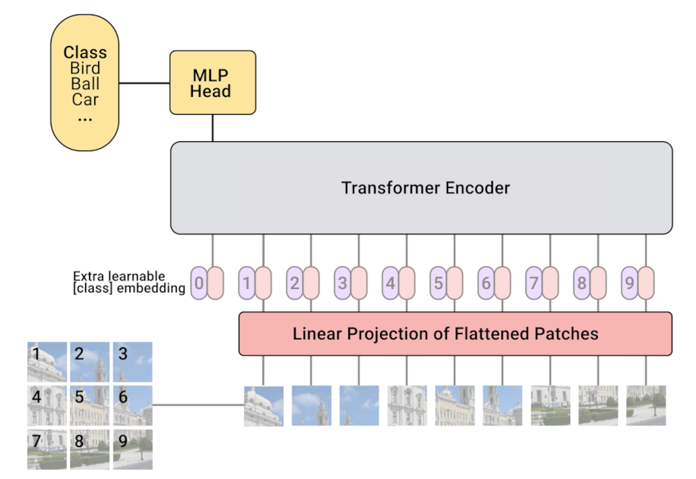

# Notes about Vision Transformer architecture

ViT architecture was introduced in paper [`An Image is Worth 16x16 Words: Transformers for Image Recognition at Scale`](https://arxiv.org/abs/2010.11929) and basically adapts transformer architecture for computer vision tasks.

It's done by transforming an input image into a set of patches of size 16x16 (though this value can be changed) where each patch is represented by a vector of size Cx16x16 (C - number of channels). Before passing into a model usually this vector is mapped to model's embeddings size through linear layer.

Essentially a regular transformer model for NLP task takes an input (T, C) that consists of a sequence of tokens (T) and each token is represented by a vector of size (C).  
ViT does basically the same: input image of size CxHxW (channels, height, width) is transformed into an input of size (T, C) where T - number of tokens, which is in our case is the number of patches (into how many patches of size PxP the image of size HxW can be splitted). In the image above T = 9.

In addition classification token (`CLS`) is prepended to the list of input tokens. This token is used for classification hence the name. It reflects `BERT` architecture.

Other then that it's just a regular transformer architecture.

## Notes about Transformer architecture

pic 1: Transformer architecture[^1] (encoder on the left and decoder is on the right side).

In this repository the focus is on the encoder part of transformer architecture as the intent is to encode input tensor into a vector that can be used to accurately classify an image.

Encoder consists of transformer blocks and each transformer block consists of two distinct layers:

1. Self-attention layer.
2. Feed-forward layer.

pic 2: Transformer block[^1].

Now let's talk about each layer of transformer block in more details.

## Self-attention

Self-attention layer is used to have such embeddings for each token that the embeddings vector contains not only information about the token itself but also about token\tokens surrounding it in which it is interested the most (highest attention).

It is done via transforming each token embedding into key, query and value vector through dot products of vector of token x and weight matrices K, Q an V.

Intuitively speaking:

- query: what the token is interested in *(a vector you want to calculate attention for)*
- key: what the token represents *(a vector you want to calculate attention against)*
- value: if someone is interested in the token, that's the value will be returned

> **Note**: You can also think about it as a python dictionary. A dictionary has keys and values. Query is what we are looking for. But instead of exact matching we are calculating query's "interest" (attention scores) for each key. Then we use these scores to see what portion of each value to take and sum these portions to get the final result. 
For examples: two key-value pairs and one query. We calculate attention scores between this query and two keys and get let's say [0.1, 0.9]. That shows that the query is interested in the second key-value pair the most, but also there are some interest in the first one. So the output will be not the second value, but 'value1\*0.1 + value2\*0.9'.

As we obtain key and value vectors from token x itself (and not from external source) that means that we perform self-attention.

Then by multiplying key and query for each token and passing it through softmax operation, we obtain attention map, which we can use in order to do weight averaging of values. If it doesn't make sense to you please read this awesome article[^1].

More notes about attention from Andrej Karpathy's notebook[^2]:

- Attention is a **communication mechanism**. Can be seen as nodes in a directed graph looking at each other and aggregating information with a weighted sum from all nodes that point to them, with data-dependent weights.
- There is no notion of space. Attention simply acts over a set of vectors. This is why we need to positionally encode tokens.
- Each example across batch dimension is of course processed completely independently and never "talk" to each other
- "self-attention" just means that the keys and values are produced from the same source as queries. In "cross-attention", the queries still get produced from x, but the keys and values come from some other, external source (e.g. an encoder module)
- "Scaled" attention additional divides `wei` by $\sqrt{head\_size}$. This makes it so when input Q,K are unit variance, wei will be unit variance too and Softmax will stay diffuse and not saturate too much.

## Feed-forward

Then we have simple fully connected layer/layers. Why do we need this?

If there is no feed-forward layer, self-attention is simply a process of re-averaging of value vectors. In order to add element-wise non-linearity transformation of incoming vectors we add feed-forward part.

You can think about it in this way:

- attention step is for communication between tokens
- feed-forward is for processing this information (of how tokens are related to each other via attention)

The same feed-forward layer is applied on each self-attention output independently.

## AddNorm

Also one can notice additional step in each transformer block: addition (residual connection) and normalization operations. Both are used in order to be able to effectively build deep learning models (with many layers).

## Positional embeddings

Since attention doesn't have any notion of space and we want to preserve this information positional embeddings are used. They are simply added to token embeddings and contains information of relative position of each token. Positional embeddings are optimized during training the model.

## The whole model

In order to build ViT one needs to have:

1. Patch embeddings - transform input image into a set of patches.
2. Positional embeddings layer.
3. Multiple transformer blocks (self-attention, feed-forward layer and do not forget about residual connections and normalization). The number of blocks is a hyperparameter.
4. Final head fully-connected layer to transform final token embeddings into predictions.

[^1]: [Illustrated transformer](https://jalammar.github.io/illustrated-transformer/)
[^2]:[Andrej Karpathy's nanoGPT Google Colab](<https://colab.research.google.com/drive/1JMLa53HDuA-i7ZBmqV7ZnA3c_fvtXnx-?usp=sharing#scrollTo=h5hjCcLDr2WC>)
